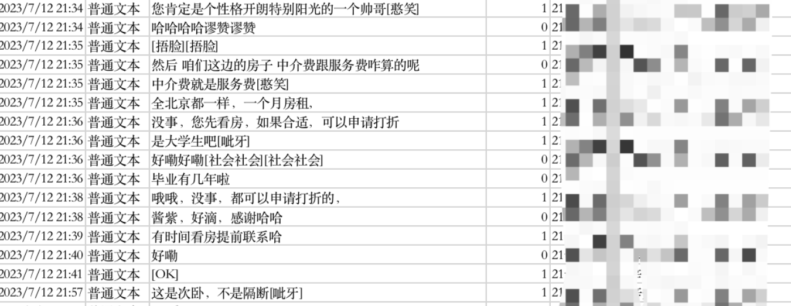

# wechatbackup
## 项目说明
项目通过pysqlcipher3，将电脑的微信聊天记录导出为csv文件保存。

适用环境：mac

python版本：python3.11


## 效果预览


## 部署方式
- 修改config/config.py配置
	- **FilePath:** 微信文件路径
	- **SECRETKEY:** 微信db的64位编码
	- **FileList:** db文件列表

## 启动方式
程序主入口。
```python
python core/main.py
```

## 更多

更多项目介绍参考CSDN文章
1、[【个人开发】通过SQLite获取微信聊天记录](https://blog.csdn.net/weixin_44505713/article/details/131486010)
2、[【个人开发】通过python导出微信聊天记录](https://blog.csdn.net/weixin_44505713/article/details/138392189)


## 写在最后
如有问题，欢迎issues讨论~
